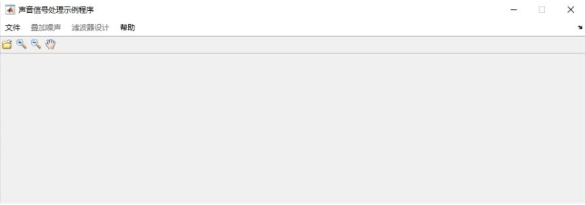
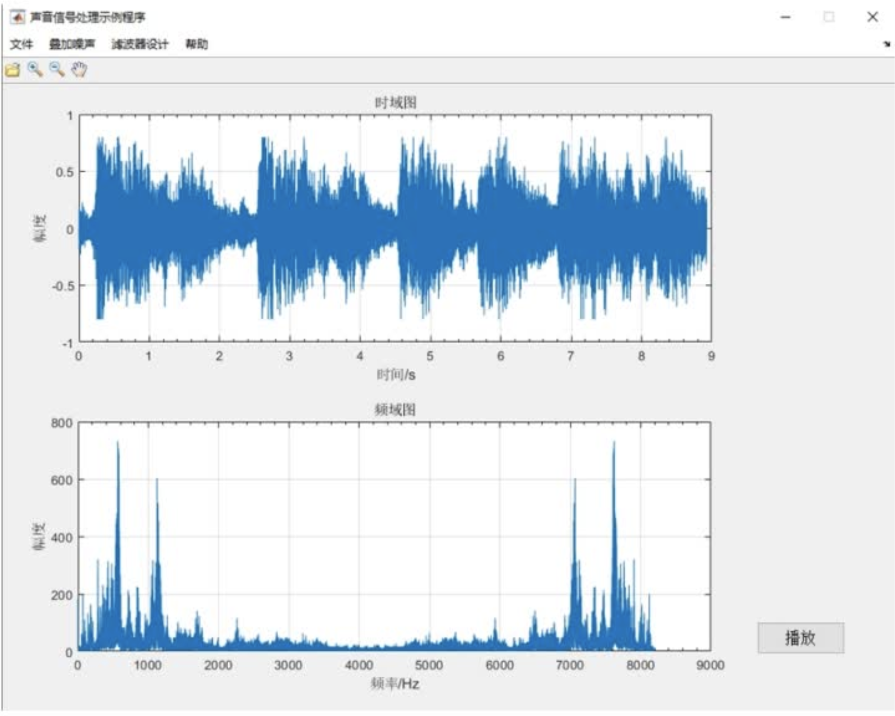
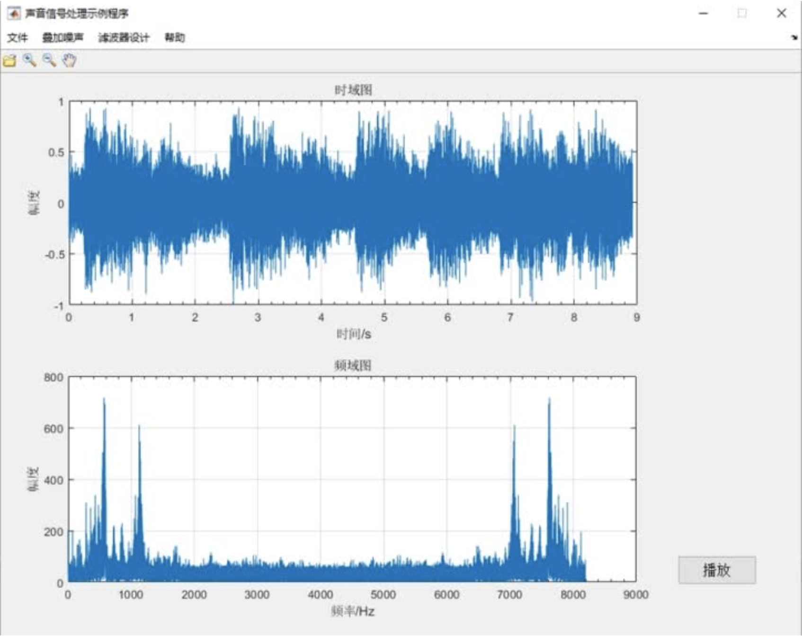
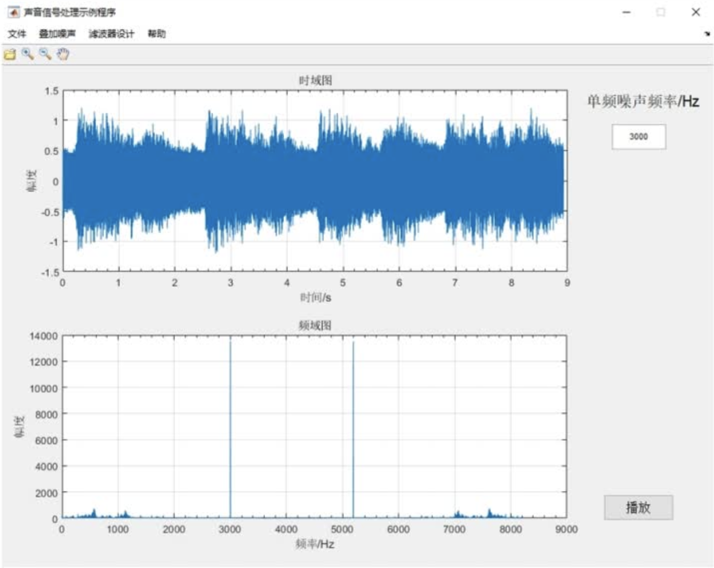
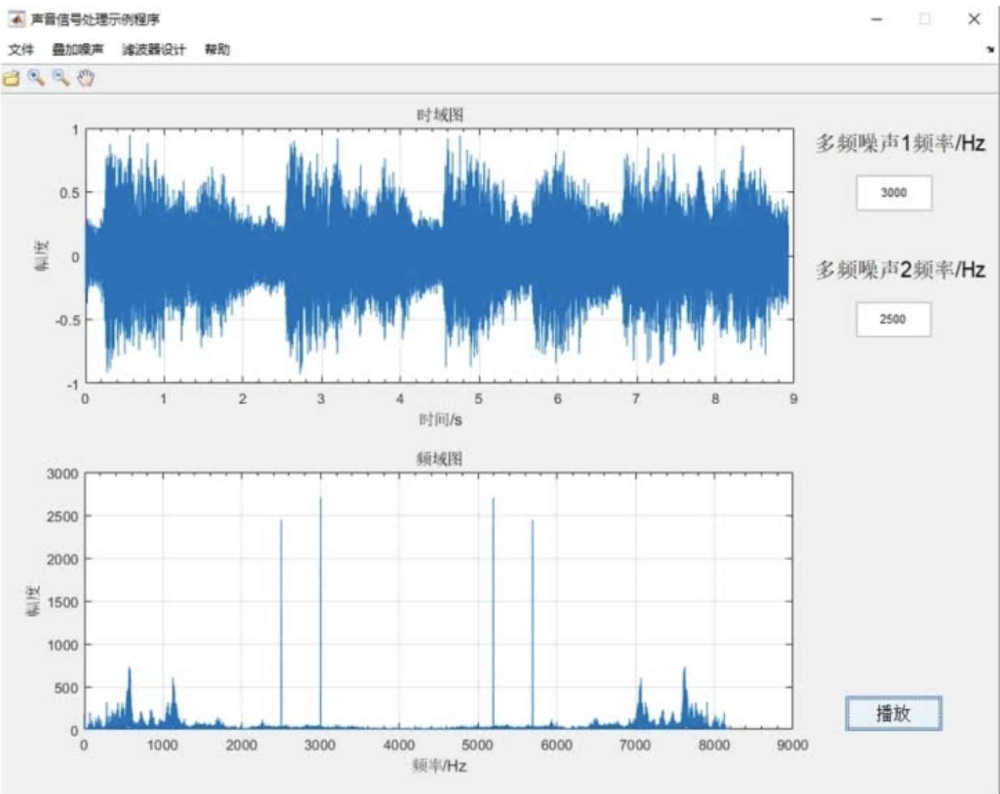
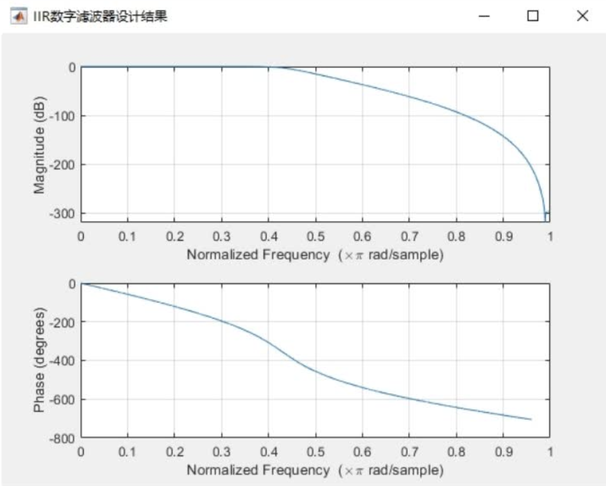
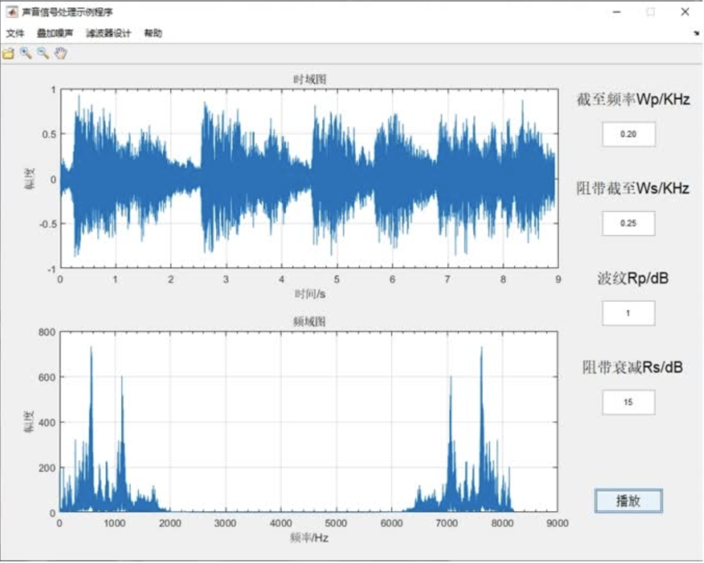
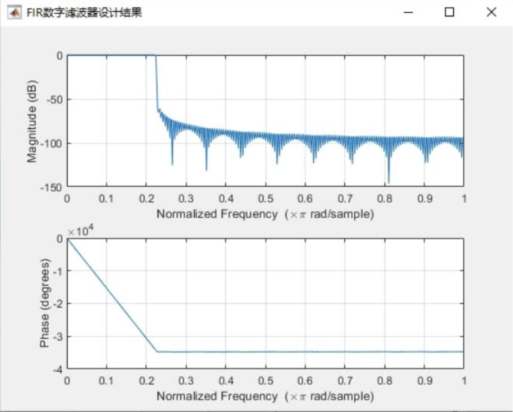
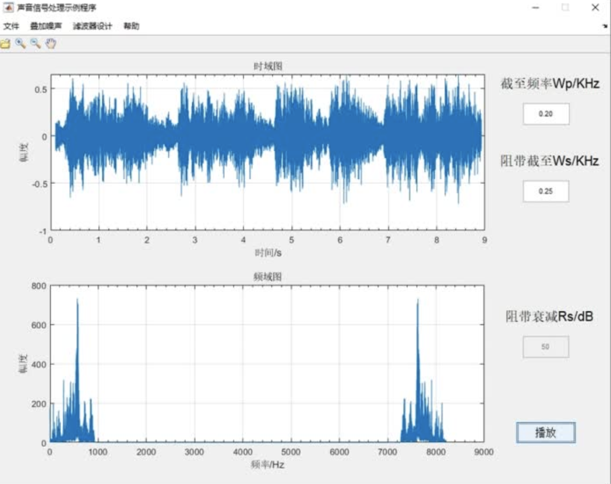

# Audio-Digital-Processing
Matlab实现语音分析：加噪声，频谱分析，滤波器等等

### 功能简介
#### 登入主页
GUI可视化实现

#### 时域频域分析
导入测试音频，囧行时域频域分析

#### 添加高斯白噪声

#### 添加单频噪声

#### 添加多频噪声

#### IIR滤波分析

#### FIR滤波分析

© JackHCC
